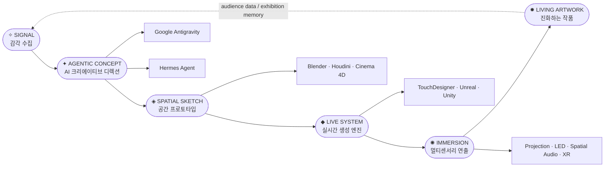

 

  
  
  
  

 

 
 

# ✦ AI × MEDIA ART ✦

### 인공지능을 활용한 미디어 아트 제작 프로젝트

> **“AI가 상상하고, 아티스트가 숨결을 불어넣고, 공간은 관객의 움직임으로 다시 태어난다.”**

 

<table align="center">
  <tr>
    <td align="center" width="33%">
      <b>✧ GENERATIVE</b> 
      생성형 이미지 · 영상 · 사운드 · 3D 컨셉
    </td>
    <td align="center" width="33%">
      <b>◈ SPATIAL</b> 
      전시장 · 프로젝션 · XR · 디지털 트윈
    </td>
    <td align="center" width="33%">
      <b>✺ LIVING</b> 
      관객 반응에 따라 진화하는 실시간 작품
    </td>
  </tr>
</table>

---

## 🌌 Project Manifesto

**AI-MediaArt**는 Google **Antigravity**와 **Hermes Agent**를 창작 파트너로 삼아,  
아이디어의 작은 신호를 **공간적 경험, 실시간 비주얼, 멀티센서리 설치, 진화형 아카이브**로 확장하는 예술 프로젝트입니다.

이 레포는 단순한 제작 기록이 아니라, 하나의 **디지털 아틀리에**입니다.  
프롬프트는 스케치가 되고, 에이전트는 조감독이 되며, 렌더 엔진은 무대가 되고, 관객은 작품의 마지막 알고리즘이 됩니다.

 

 

---

## ✨ 2026 SOTA Creative Direction

<table align="center">
  <tr>
    <th>Signal</th>
    <th>Creative Meaning</th>
    <th>How this repo uses it</th>
  </tr>
  <tr>
    <td><b>Agentic AI</b></td>
    <td>AI를 단순 생성기가 아니라 리서치·기획·반복 개선을 돕는 창작 에이전트로 사용</td>
    <td>Antigravity + Hermes Agent 기반 컨셉 디렉션</td>
  </tr>
  <tr>
    <td><b>Multimodal Creation</b></td>
    <td>텍스트, 이미지, 3D, 사운드, 센서 데이터를 하나의 창작 언어로 연결</td>
    <td>프롬프트 → 무드보드 → 공간 → 사운드 → 인터랙션</td>
  </tr>
  <tr>
    <td><b>Spatial Computing</b></td>
    <td>평면 스크린 중심이 아닌 공간, 동선, 시야, 빛의 밀도로 설계</td>
    <td>XR · 프로젝션 맵핑 · 디지털 트윈 기반 설치</td>
  </tr>
  <tr>
    <td><b>Realtime Generative</b></td>
    <td>완성된 영상 재생이 아니라 관객과 환경에 반응하는 라이브 시스템</td>
    <td>TouchDesigner · Unreal · Unity · Shader 파이프라인</td>
  </tr>
  <tr>
    <td><b>Living Archive</b></td>
    <td>작품이 끝나지 않고 전시 데이터와 관객 반응을 다음 버전으로 이어감</td>
    <td>작품 로그, 프롬프트, 센서 값, 렌더 결과 축적</td>
  </tr>
</table>

---

## 🔥 Core Pipeline — From Signal to Living Artwork

 

<table align="center">
  <tr>
    <td align="center" width="16%">
      <h3>01</h3>
      <b>✧ SIGNAL</b> 
      감각 수집  
      트렌드 · 공간 · 관객 · 사운드 · 기억
    </td>
    <td align="center" width="16%">
      <h3>02</h3>
      <b>✦ AGENTIC CONCEPT</b> 
      AI 크리에이티브 디렉션  
      Antigravity · Hermes Agent · Prompt
    </td>
    <td align="center" width="16%">
      <h3>03</h3>
      <b>◈ SPATIAL SKETCH</b> 
      공간 프로토타입  
      Blender · Houdini · Digital Twin
    </td>
    <td align="center" width="16%">
      <h3>04</h3>
      <b>◆ LIVE SYSTEM</b> 
      실시간 생성 엔진  
      TouchDesigner · Unreal · Unity
    </td>
    <td align="center" width="16%">
      <h3>05</h3>
      <b>✺ IMMERSION</b> 
      멀티센서리 연출  
      Light · Sound · Motion · XR
    </td>
    <td align="center" width="16%">
      <h3>06</h3>
      <b>✹ LIVING ARTWORK</b> 
      진화하는 작품  
      관객 반응 기반 재생성
    </td>
  </tr>
</table>

 

---

## 🖼️ Visual World

<table align="center">
  <tr>
    <td align="center" width="50%">
       
      <b>CHROMATIC ORGANISM</b> 
      빛의 생물처럼 증식하는 생성형 표면
    </td>
    <td align="center" width="50%">
       
      <b>NEURAL AURA</b> 
      데이터와 감정이 만든 비물질 조각
    </td>
  </tr>
  <tr>
    <td align="center" width="50%">
       
      <b>IMMERSIVE ROOM</b> 
      공간 전체를 하나의 살아있는 캔버스로 변환
    </td>
    <td align="center" width="50%">
       
      <b>COSMIC INTERFACE</b> 
      관객의 움직임이 별자리처럼 기록되는 인터페이스
    </td>
  </tr>
</table>

---

## 🧬 Aesthetic System

<table align="center">
  <tr>
    <th>Layer</th>
    <th>Texture</th>
    <th>Emotion</th>
    <th>Output</th>
  </tr>
  <tr>
    <td><b>Light</b></td>
    <td>Neon bloom · volumetric haze · spectral gradient</td>
    <td>몽환, 압도, 초현실</td>
    <td>LED wall · projection · shader field</td>
  </tr>
  <tr>
    <td><b>Geometry</b></td>
    <td>Chrome fluid · procedural mesh · neural topology</td>
    <td>미래적, 유기적, 낯선 아름다움</td>
    <td>3D sculpture · motion graphic · XR object</td>
  </tr>
  <tr>
    <td><b>Motion</b></td>
    <td>Particle swarm · slow cinema · reactive pulse</td>
    <td>몰입, 호흡, 긴장</td>
    <td>Realtime visual performance</td>
  </tr>
  <tr>
    <td><b>Sound</b></td>
    <td>Spatial drone · granular voice · data sonification</td>
    <td>의식, 기억, 의례</td>
    <td>Spatial audio · interactive score</td>
  </tr>
</table>

---

## 🛠️ Product Stack — Creative Engine Room

> 제품 자체가 이 프로젝트의 악기입니다. **TouchDesigner, Houdini, Blender, Unreal Engine, Unity**를 전면에 세우고, AI Agent와 Adobe/Cinema 4D 계열 툴을 조합해 하나의 예술 제작 파이프라인으로 사용합니다.

 

  
  
  
  
  

  
  
  
  
  

 

<!-- ▼ Real product logos via Simple Icons CDN & local assets ▼ -->
<table align="center">
  <tr>
    <td align="center" width="120">
       <b>TouchDesigner</b>
    </td>
    <td align="center" width="120">
       <b>Houdini</b>
    </td>
    <td align="center" width="120">
       <b>Blender</b>
    </td>
    <td align="center" width="120">
       <b>Unreal Engine</b>
    </td>
    <td align="center" width="120">
       <b>Unity</b>
    </td>
  </tr>
  <tr>
    <td align="center" width="120">
       <b>Cinema 4D</b>
    </td>
    <td align="center" width="120">
       <b>Substance 3D</b>
    </td>
    <td align="center" width="120">
       <b>Google Antigravity</b>
    </td>
    <td align="center" width="120">
       
      <b>Hermes Agent</b>
    </td>
    <td align="center" width="120">
       
      <b>GLSL / HLSL</b>
    </td>
  </tr>
</table>

 

<table align="center">
  <tr>
    <th width="25%">Product</th>
    <th width="25%">Role</th>
    <th width="25%">Artistic Output</th>
    <th width="25%">Why it matters</th>
  </tr>
  <tr>
    <td align="center">
       
      <b>TouchDesigner</b>
    </td>
    <td>실시간 비주얼 시스템 · 센서 인터랙션 · 오디오 리액티브 패치</td>
    <td>라이브 제너러티브 영상, 인터랙티브 설치, 퍼포먼스 VJ 시스템</td>
    <td><b>이 프로젝트의 심장.</b> 관객의 움직임과 소리를 즉시 빛으로 번역</td>
  </tr>
  <tr>
    <td align="center">
       
      <b>Houdini</b>
    </td>
    <td>프로시저럴 모델링 · 파티클 · 시뮬레이션 · FX</td>
    <td>유기적 조형, 데이터 기반 형태, 크롬 플루이드, 파티클 오션</td>
    <td>규칙과 우연을 결합해 예측 불가능한 조형 언어 생성</td>
  </tr>
  <tr>
    <td align="center">
       
      <b>Blender</b>
    </td>
    <td>3D 모델링 · 애니메이션 · 카메라 · 레이아웃</td>
    <td>공간 스케치, 조형물, 씬 프리비즈, 렌더 콘셉트</td>
    <td>아이디어를 가장 빠르게 볼륨과 장면으로 변환</td>
  </tr>
  <tr>
    <td align="center">
       
      <b>Unreal Engine</b>
    </td>
    <td>실시간 렌더링 · 버추얼 프로덕션 · 몰입형 공간</td>
    <td>시네마틱 XR, 가상 전시장, 실시간 빛/재질 시뮬레이션</td>
    <td>게임 엔진을 전시장의 실시간 무대 장치로 확장</td>
  </tr>
  <tr>
    <td align="center">
       
      <b>Unity</b>
    </td>
    <td>인터랙티브 설치 · XR · 앱/프로토타입 · 관객 입력 시스템</td>
    <td>AR/VR 경험, 인터랙션 프로토타입, 센서 기반 작품</td>
    <td>관객 참여형 작품을 빠르게 구현하고 배포</td>
  </tr>
  <tr>
    <td align="center">
       
      <b>Cinema 4D</b>
    </td>
    <td>모션 디자인 · 타이포그래피 · 브랜딩 비주얼</td>
    <td>전시 타이틀, 영상 인트로, 키비주얼 모션</td>
    <td>작품의 그래픽 아이덴티티와 쇼케이스 완성도 강화</td>
  </tr>
  <tr>
    <td align="center">
       
      <b>Substance 3D</b>
    </td>
    <td>재질 · 텍스처 · 표면 실험</td>
    <td>크롬, 유리, 생체 표면, 노이즈 기반 물성</td>
    <td>디지털 조각에 촉각적 리얼리티와 낯선 물성을 부여</td>
  </tr>
  <tr>
    <td align="center">
       
      <b>Google Antigravity</b>
    </td>
    <td>AI 기반 아이데이션 · 컨셉 확장 · 창작 방향 탐색</td>
    <td>컨셉 문장, 무드보드, 프롬프트 변주, 작품 시나리오</td>
    <td>초기 아이디어를 여러 개의 예술적 가능성으로 증식</td>
  </tr>
  <tr>
    <td align="center">
       
      <b>Hermes Agent</b>
    </td>
    <td>에이전트 워크플로우 · 제작 보조 · 반복 개선</td>
    <td>리서치 노트, 프롬프트 팩, 작업 계획, README/문서화</td>
    <td>아티스트의 조감독처럼 제작 흐름을 정리하고 확장</td>
  </tr>
  <tr>
    <td align="center">
       
      <b>GLSL / HLSL</b>
    </td>
    <td>커스텀 셰이더 · 실시간 픽셀/버텍스 조작</td>
    <td>빛 번짐, 노이즈 필드, 유체적 왜곡, 데이터 기반 패턴</td>
    <td>작품의 표면과 빛을 직접 설계하는 가장 원초적인 레이어</td>
  </tr>
</table>

---

## 🎞️ Exhibition Concepts

<table align="center">
  <tr>
    <td align="center" width="33%">
       
      <b>01 · Memory Weather</b> 
      관객의 움직임이 빛의 날씨로 번역되는 설치
    </td>
    <td align="center" width="33%">
       
      <b>02 · Synthetic Garden</b> 
      AI가 자라내는 디지털 정원과 유기적 사운드
    </td>
    <td align="center" width="33%">
       
      <b>03 · Cosmic Archive</b> 
      관객 반응이 별자리 데이터로 축적되는 아카이브
    </td>
  </tr>
  <tr>
    <td align="center" width="33%">
       
      <b>04 · Data Ritual</b> 
      센서 데이터가 의식처럼 반복되는 라이브 퍼포먼스
    </td>
    <td align="center" width="33%">
       
      <b>05 · Neon Fossil</b> 
      미래의 폐허에서 발견된 빛의 화석
    </td>
    <td align="center" width="33%">
       
      <b>06 · Dream Engine</b> 
      프롬프트와 사운드가 실시간 꿈을 렌더링하는 엔진
    </td>
  </tr>
</table>

---

## 🚀 Production Workflow

<table align="center">
  <tr>
    <th>Phase</th>
    <th>Action</th>
    <th>Artifact</th>
  </tr>
  <tr>
    <td><b>01 · Research</b></td>
    <td>작품 주제, 공간, 관객, 감정 키워드 수집</td>
    <td>Concept note · mood keywords · reference atlas</td>
  </tr>
  <tr>
    <td><b>02 · AI Direction</b></td>
    <td>Agentic AI로 시각 언어, 장면, 프롬프트 변주 생성</td>
    <td>Prompt pack · moodboard · visual bible</td>
  </tr>
  <tr>
    <td><b>03 · Spatial Prototype</b></td>
    <td>공간 스케치, 카메라, 조명, 동선, 볼륨 구성</td>
    <td>Blender / Houdini scene · digital twin</td>
  </tr>
  <tr>
    <td><b>04 · Realtime System</b></td>
    <td>센서, 사운드, 움직임에 반응하는 라이브 패치 구축</td>
    <td>TouchDesigner network · shader · engine scene</td>
  </tr>
  <tr>
    <td><b>05 · Installation</b></td>
    <td>프로젝션, LED, 스피커, XR, 물리 공간 설치</td>
    <td>Exhibition setup · calibration map</td>
  </tr>
  <tr>
    <td><b>06 · Archive</b></td>
    <td>전시 데이터와 관객 반응을 다음 버전으로 축적</td>
    <td>Living archive · dataset · post-mortem</td>
  </tr>
</table>

---

## 📁 Repository Atlas

| Path | Meaning |
|---|---|
| `docs/` | 프로젝트 문서, 기획서, 전시 노트 |
| `assets/` | 이미지, 영상, 사운드, 텍스처 에셋 |
| `ai-prompts/` | 프롬프트, 생성 결과, 무드보드 기록 |
| `blender/` | Blender 모델링, 애니메이션, 카메라 씬 |
| `houdini/` | Houdini FX, 프로시저럴 시스템, 시뮬레이션 |
| `touchdesigner/` | TouchDesigner 패치, 인터랙션 네트워크 |
| `unreal/` | Unreal Engine 실시간 렌더링, XR 씬 |
| `unity/` | Unity 인터랙티브 설치, XR 프로토타입 |

---

## 🗺️ Roadmap

- [x] 2026형 SOTA README 비주얼 시스템 구축
- [x] 제품 중심 기술 스택 + 로고 배지 강화
- [ ] AI 프롬프트 아카이브 정리
- [ ] TouchDesigner 실시간 비주얼 프로토타입 추가
- [ ] Houdini 프로시저럴 조형 실험 업로드
- [ ] Unreal / Unity 기반 XR 전시 씬 구성
- [ ] 관객 반응 기반 Living Artwork 데이터 구조 설계

---

## 📊 Project Pulse

  
  
  
  

---

## 🎨 Keywords

`#TouchDesigner` `#Houdini` `#Blender` `#UnrealEngine` `#Unity` `#Cinema4D` `#Substance3D`  
`#AgenticAI` `#GenerativeAI` `#MediaArt` `#SpatialComputing` `#RealtimeGenerative`  
`#ProjectionMapping` `#DigitalTwin` `#InteractiveInstallation` `#LivingArtwork`  
`#AIArt` `#ProceduralArt` `#DataSonification` `#ImmersiveExperience` `#VisualRitual`

 

Made with 🤖 AI + 💜 Passion by <a href="https://github.com/libreleee">libreleee</a>

