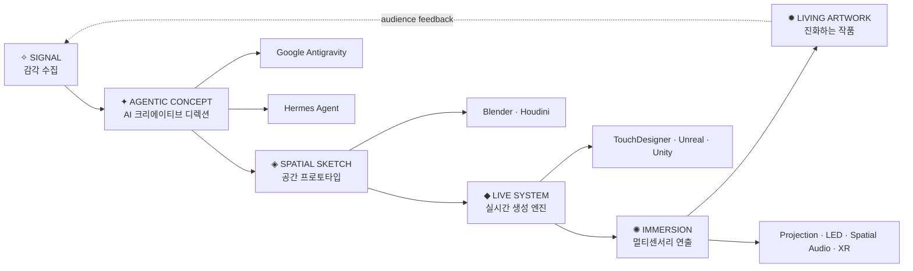

<!-- Animated Header Banner -->

---

# ✦ AI × Media Art ✦

### 인공지능을 활용한 미디어 아트 제작 프로젝트

> *"AI가 상상하고, 아티스트가 숨결을 불어넣다"*

---

## 🌌 프로젝트 소개

**AI-MediaArt**는 Google **Antigravity** 와 **Hermes Agent** 를 활용하여
AI 기반 시안(concept draft)을 생성하고,
다양한 3D · 실시간 렌더링 도구들과 결합해
**몰입형 미디어 아트 작품**을 제작하는 프로젝트입니다.

---

## ✨ 핵심 파이프라인 2026

> **Agentic AI · Spatial Computing · Realtime Generative System · Multi‑sensory Experience**를 하나의 감각적 제작 흐름으로 연결합니다.

 

<table align="center">
  <tr>
    <td align="center" width="16%">
      <b>01</b> 
      ✧ SIGNAL 
      <b>감각 수집</b> 
      트렌드 · 공간 · 관객 데이터
    </td>
    <td align="center" width="16%">
      <b>02</b> 
      ✦ AGENTIC CONCEPT 
      <b>AI 크리에이티브 디렉션</b> 
      Antigravity · Hermes Agent
    </td>
    <td align="center" width="16%">
      <b>03</b> 
      ◈ SPATIAL SKETCH 
      <b>공간 프로토타입</b> 
      Blender · Houdini · Digital Twin
    </td>
    <td align="center" width="16%">
      <b>04</b> 
      ◆ LIVE SYSTEM 
      <b>실시간 생성 엔진</b> 
      TouchDesigner · Unreal · Unity
    </td>
    <td align="center" width="16%">
      <b>05</b> 
      ✺ IMMERSION 
      <b>멀티센서리 연출</b> 
      Light · Sound · Motion · XR
    </td>
    <td align="center" width="16%">
      <b>06</b> 
      ✹ LIVING ARTWORK 
      <b>진화하는 작품</b> 
      관객 반응 기반 재생성
    </td>
  </tr>
</table>

 

### 🧬 제작 원칙

| 키워드 | 방향 |
|---|---|
| **Agentic Workflow** | AI가 단순 생성기를 넘어 리서치·무드보드·프롬프트·반복 개선을 보조 |
| **Spatial-first** | 화면이 아닌 공간, 관객 동선, 빛의 밀도부터 설계 |
| **Realtime Generative** | 고정 영상이 아니라 센서·음성·움직임에 반응하는 라이브 비주얼 구축 |
| **Multi-sensory** | 영상 + 사운드 + 조명 + 모션 + XR을 하나의 감각 레이어로 통합 |
| **Living Archive** | 전시 이후에도 데이터와 관객 반응을 축적해 다음 작품으로 진화 |

---

## 🛠️ 사용 기술 스택

<table align="center">
  <tr>
    <th>🤖 AI / Agent</th>
    <th>🎨 3D / FX</th>
    <th>⚡ 실시간 / 인터랙티브</th>
  </tr>
  <tr>
    <td align="center">
      Google Antigravity 
      Hermes Agent 
      Generative AI 
      Prompt Engineering
    </td>
    <td align="center">
      🟠 Blender 
      🟡 Houdini 
      Substance Painter 
      Cinema 4D
    </td>
    <td align="center">
      🔵 TouchDesigner 
      🔴 Unreal Engine 
      🟢 Unity 
      GLSL / HLSL Shader
    </td>
  </tr>
</table>

---

## 🖼️ 작품 샘플 / 비주얼 레퍼런스

<table align="center">
  <tr>
    <td align="center" width="33%">
       
      <b>🌀 Generative Flow</b> 
      AI × Houdini 프로시저럴 아트
    </td>
    <td align="center" width="33%">
       
      <b>💠 Neural Geometry</b> 
      AI × Blender 생성 조형물
    </td>
    <td align="center" width="33%">
       
      <b>✨ Immersive Space</b> 
      TouchDesigner × Unreal 몰입 공간
    </td>
  </tr>
  <tr>
    <td align="center" width="33%">
       
      <b>🌊 Particle Ocean</b> 
      Houdini × AI 파티클 시스템
    </td>
    <td align="center" width="33%">
       
      <b>🌌 Cosmic Dream</b> 
      AI 생성 우주 미디어아트
    </td>
    <td align="center" width="33%">
       
      <b>⚡ Data Pulse</b> 
      실시간 인터랙티브 설치
    </td>
  </tr>
</table>

---

## 🚀 제작 워크플로우

### 1️⃣ AI 시안 생성

| 단계 | 내용 |
|------|------|
| 🔎 프롬프트 설계 | 텍스트 기반 비주얼 컨셉 생성 |
| 🖼️ 무드보드 | 레퍼런스 이미지 자동 구성 |
| 📐 레이아웃 | 3D 공간 초안 도출 |

### 2️⃣ 3D 제작 & FX

| 툴 | 역할 |
|----|------|
| 🟠 Blender | 3D 모델링 / 애니메이션 |
| 🟡 Houdini | 프로시저럴 이펙트 & 시뮬레이션 |

### 3️⃣ 실시간 렌더링 & 인터랙션

| 툴 | 역할 |
|----|------|
| 🔵 TouchDesigner | 실시간 비주얼 퍼포먼스 |
| 🔴 Unreal Engine | 실시간 렌더링 / 메타버스 |
| 🟢 Unity | 인터랙티브 설치 / XR |

### 4️⃣ 작품 완성 & 전시

| 형식 | 내용 |
|------|------|
| 📽️ 프로젝션 맵핑 | 공간에 미디어 투사 |
| 💡 LED 인스톨레이션 | 하드웨어 설치 작품 |
| 🏛️ 몰입형 전시 | 관객 인터랙션 공간 |

---

## 📁 디렉토리 구조

| 폴더 | 내용 |
|------|------|
| 📂 `docs/` | 프로젝트 문서 & 기획서 |
| 📂 `assets/` | 이미지, 영상, 사운드 에셋 |
| 📂 `blender/` | Blender 프로젝트 파일 |
| 📂 `houdini/` | Houdini FX 파일 |
| 📂 `touchdesigner/` | TouchDesigner 패치 |
| 📂 `unreal/` | Unreal Engine 프로젝트 |
| 📂 `unity/` | Unity 프로젝트 |
| 📂 `ai-prompts/` | AI 프롬프트 & 생성 결과물 |

---

## 📊 프로젝트 현황

---

## 🎨 관련 키워드

`#GenerativeAI` `#MediaArt` `#DigitalArt` `#Blender` `#Houdini`
`#TouchDesigner` `#UnrealEngine` `#Unity` `#GoogleAntigravity`
`#HermesAgent` `#InteractiveArt` `#ImmersiveArt` `#ProceduralArt`
`#AIArt` `#XR` `#ProjectionMapping` `#3DArt` `#VisualArt`

---

Made with 🤖 AI + 💜 Passion by <a href="https://github.com/libreleee">libreleee</a>

